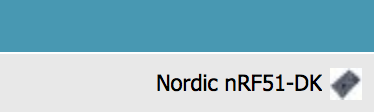
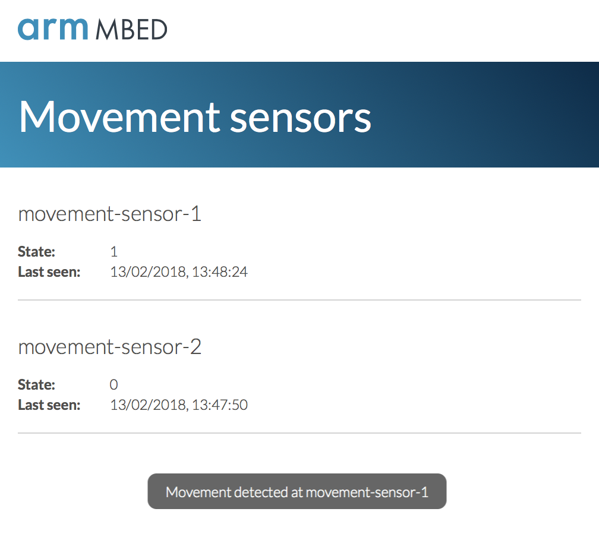
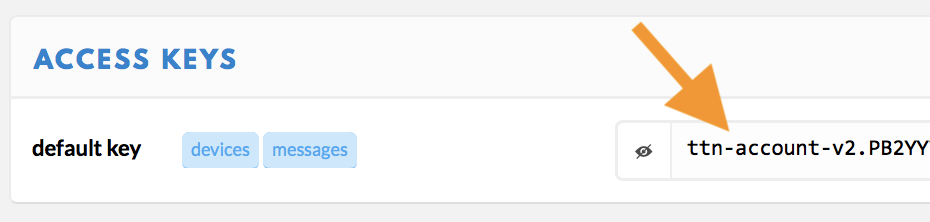

# Building your own private LoRa network

There is a lot of buzz about [LoRa](https://www.lora-alliance.org), a wide-area network solution that promises kilometers of range with very low power consumption, a perfect fit for the Internet of Things. Telecom operators are rolling out LoRa networks, but because LoRa operates in the [open spectrum](https://en.wikipedia.org/wiki/ISM_band), you can also set up your own network. This article discusses the requirements to build a private LoRa network and how to use the network to send data from an Arm Mbed end-node to the cloud.

<span class="notes">**Note on LoRa vs. LoRaWAN:** Technically, we're building a LoRaWAN network in this article. LoRa is the modulation technique used (PHY), and LoRaWAN is the network protocol on top of the physical layer (MAC).</span>

## Requirements

A typical LoRa network consists of four parts: devices, gateways, a network service and an application:

<span class="images"><span>Topology of a LoRa network</span></span>

For hardware, you need devices and gateways, similar to how you would set up a Wi-Fi network. Gateways are simple: they just scan the spectrum and capture LoRa packets. There is no gateway pinning here - devices are not associated with a single gateway; thus, all gateways within range of a device receive the signal. The gateways then forward their data to a network service that handles the packet.

The network service deduplicates packets when multiple gateways receive the same packet, decrypts the message (everything is end-to-end encrypted), handles LoRa features such as adaptive data rating and so on. It then forwards the decrypted data to your application. Often, network service providers allow you to run parts of the network - like the application server, which decrypts the messages - yourself.

There are five requirements.

We need hardware:

* Gateways.
* Devices.

And we need software:

* Device firmware.
* A network service.
* An app.

This guide shows you which hardware you can buy, how to configure a gateway, how to write some device firmware, and how to set up a web application to show your LoRa traffic.

Note that the frequency that LoRa uses differs per region. Make sure you get gateways and devices that are legal in your jurisdiction. For example, use 915 MHz radios in the United States, and an 868 MHz radio in Europe. More information can be found in the [LoRaWAN regional parameters](http://net868.ru/assets/pdf/LoRaWAN-Regional-Parameters-v1.1rA.PDF) specification.

### Getting a gateway

You have [a lot of choices in the gateways](https://www.loriot.io/lora-gateways.html) you can use, but we've had good experience with these three:

* [Kerlink Wirnet station](https://www.kerlink.com/product/wirnet-station/). Expensive (around 1,200 euros) but great build quality and range.
* [Multi-Tech Conduit](http://www.multitech.com/brands/multiconnect-conduit). About one-third of the price of the Kerlink (about 450 euros) and good for smaller setups. Multi-Tech also has a [rugged outdoor](http://www.multitech.com/brands/multiconnect-conduit-ip67) version. Make sure you also order the LoRa mCard.
* Building your own with a Raspberry Pi and an [IMST iC880A](http://shop.imst.de/wireless-modules/lora-products/8/ic880a-spi-lorawan-concentrator-868-mhz) concentrator. At about 150 euros, this is a cost-efficient option.

<span class="images"><span>Self-built LoRa gateway based on Raspberry Pi 2 and IMST iC880A. Total cost is about 150 euros.</span></span>

For development purposes, one gateway is enough, but in a production deployment, you need at least two because there will always be dark spots in your network.

<span class="images"><span>Kerlink Wirnet station overlooking the Oslo fjord.</span></span>

### Getting a device

You also need to build devices. If you use Mbed OS (and you should), you can either use:

* A development board with a LoRa transceiver:
    * [L-TEK FF1705](https://os.mbed.com/platforms/L-TEK-FF1705/).
    * [Multi-Tech xDot](https://developer.mbed.org/platforms/MTS-xDot-L151CC/).
    * [Multi-Tech mDot](https://developer.mbed.org/platforms/MTS-mDot-F411/) and the [UDK2 board](http://www.digikey.com/product-detail/en/multi-tech-systems-inc/MTUDK2-ST-MDOT/591-1278-ND/5247463).
    * [Multi-Tech mDot EVB](https://developer.mbed.org/platforms/mdotevb/).
    * [B-L072Z-LRWAN1 LoRa®Discovery kit](https://os.mbed.com/platforms/ST-Discovery-LRWAN1/).
* An Mbed OS 5-enabled development board together with a LoRa shield:
    * [SX1272MB2xAS](https://developer.mbed.org/components/SX1272MB2xAS/) - shield based on the SX1272 transceiver.
    * [SX1276MB1xAS](https://developer.mbed.org/components/SX1276MB1xAS/) - shield based on the SX1276 transceiver.

This tutorial applies to all combinations listed above.

<span class="notes">**Note:** When ordering hardware, always make sure you get the variant that works in your region (for example 868 MHz in Europe, 915 MHz in the US).</span>

### Network server

Now on to the software side. You need a server that understands the LoRa protocol and can interpret the data the device sends. It's possible to roll your own (Semtech can give you its reference implementation if you sign an NDA), but there are also companies building LoRa network servers as a service, handling everything on your behalf. This article uses [The Things Network](https://www.thethingsnetwork.org), an open source, globally distributed network service that also has a free hosted community edition.

Because a network server only processes your data and doesn't store it, you need a place to store your messages, as well. The Things Network allows you to hook into their service through an MQTT client and forward your data to the cloud service of your choice (or straight to your application).

## Setting up the gateway

You now need to configure the gateway by installing software that scans the spectrum and forwards all LoRa packets to the network server. To do this, you will need to log into the gateway. Below are setup instructions for the three gateways suggested earlier.

<span class="notes">**Note:** This section assumes that you're familiar with SSH.</span>

### Kerlink IoT station

To configure the Kerlink:

1. Connect the gateway to your network over Ethernet.
1. The gateway gets an IP through DHCP.
1. To quickly find the gateway, look in the DHCP table on your router or use [nmap](http://nmap.org) via `nmap -p 22 192.168.2.*` (if that's your subnet).
1. You can now log into the gateway through SSH with the username `root` and password `root` (if using 2.x firmware) or `pdmk-0` followed by the last seven numbers of the gateway's serial number (if using 3.x firmware).

### MultiTech Conduit

The Conduit is configured with DHCP disabled, so you need to enable this first. There are two options to do this: either via Ethernet or via micro-USB.

__Using Ethernet__

1. Connect to the Conduit over Ethernet (from the Conduit to your computer).
1. Set a static IP address of 192.168.2.2 for your computer.
1. Set a static IP address of 192.168.2.1 as your router.
1. Log in through SSH to 192.168.2.1 with the username `root` and password `root`.


__Over micro-USB__

1. Connect to the Conduit using a micro-USB cable.
1. The gateway appears as a serial device.
1. You can use a program such as [GNU screen](https://www.gnu.org/software/screen/) or [PuTTY](http://putty.org) to log into the gateway with the username `root` and password `root`.

<span class="notes">**Note when logging in fails:** If logging in as `root` fails, but you can log in with the username `admin` and the password `admin`, you are running the AEP firmware. To proceed, update your gateway firmware to mLinux. Instructions are [here](http://www.multitech.net/developer/software/mlinux/using-mlinux/flashing-mlinux-firmware-for-conduit/).</span>

Now that you are connected, you can set up the gateway:

1.  Enable DHCP by following Step 4 in [this document](http://www.multitech.net/developer/software/mlinux/getting-started-with-conduit-mlinux/).
1. Connect the gateway over Ethernet to your router.
1. Verify that the gateway is connected to the internet (for example, by running `ping 8.8.4.4`).

### Raspberry Pi and IMST iC880A

First, make sure that the Raspberry Pi is connected to the internet and that you connected the IMST iC880A over USB. (If you have the SPI version, look at the [IMST website](http://www.wireless-solutions.de/products/radiomodules/ic880a)).

Log into the Pi over SSH, and follow Steps 3.1 - 3.5 in [this document](http://www.wireless-solutions.de/images/stories/downloads/Radio%20Modules/iC880A/iC880A_QuickStartGuide.pdf).

<span class="notes">**Note:** Use [lora_gateway 2.0.0](https://github.com/Lora-net/lora_gateway/releases/tag/v2.0.0), not the latest version. (Run `git checkout v2.0.0` in the lora_gateway folder).</span>

After following these steps:

1. Restart the Pi.
1. Run:

    ``~/LoRa/lora_gateway/lora_gateway/util_pkt_logger/util_pkt_logger``

1. You see 'INFO: concentrator started, packet can now be received', which indicates that everything is functioning.

## Installing the packet forwarder

Now that you have set up the gateways and they can reach the internet, it's time to install the The Things Network software on them, so they have a place to send the LoRa packets. This software is called a 'packet forwarder' - as it captures LoRa packets and forwards them.

### Registering the gateway

1. [Sign up](https://console.thethingsnetwork.org) for an account.
1. You're redirected to the dashboard page.
1. Click *Gateways*.

    <span class="images"></span>

1. Click *Register gateway*.

    <span class="images"></span>

1. Fill in the details of your gateway.

    <span class="images"><span>Gateway details, make sure the location is set correctly so coverage maps can be updated.</span></span>

1. Click *Register gateway*.
1. The gateway is now created, to authenticate the gateway you need the 'Gateway key'. Copy it.

    <span class="images"></span>

### Installing the packet forwarder

**Kerlink IoT station**

<span class="notes">**Note on the Kerlink IoT station:** Often, the Kerlink IoT station comes preconfigured with the packet forwarder (run `ps | grep pkt` to see if one is running). If this is the case, make sure the packet forwarder does not start on startup by removing the entry from `/etc/init.d`.</span>

??

**Multi-Tech Conduit**

1. On the gateway run:

    ```
    $ wget https://github.com/kersing/multitech-installer/raw/master/installer.sh
    $ sh installer.sh
    ```

1. A wizard starts. Answer the questions.

    <span class="images"><span>Wizard for configuring the Multi-Tech Conduit</span></span>.

1. After the gateway reboots, log back in.
1. Then run (again):

    ```
    $ sh installer.sh
    ```

1. And fill in the remaining questions.

    <span class="images"><span>Wizard (2) for configuring the Multi-Tech Conduit</span></span>.

1. After this the gateway should show as 'Connected' in the TTN console.

    <span class="images"><span>Connected!</span></span>

**Raspberry Pi + IMST iC880A**

???

<span class="tips">**Tip:** TTN has a 'Traffic' tab, which you can access from your gateway page. This allows you to see what messages the gateway is picking up, which is useful when debugging.</span>

### Automatically starting the packet forwarder binary when the gateway starts

#### Kerlink IoT station

???

#### MultiTech Conduit

???

#### Raspberry Pi and IMST iC880A

Follow the steps on [this page](http://raspberrypi.stackexchange.com/questions/8734/execute-script-on-start-up) to start the packet forwarder when the Raspberry Pi starts up.

## Building a device

Now to the interesting work: building a device that can send sensor data over the LoRa network. For example, you can create a motion sensor using a [PIR sensor](https://www.adafruit.com/products/189) (less than 10 euros at your local hardware store and 2 euros when ordering from China). Of course, you can use any other sensor.

<span class="images"><span>PIR sensor hooked up to a Nordic Semiconductor nRF51-DK with a SX1276 LoRa shield</span></span>

### Some notes on writing firmware

#### Sending data constantly

You cannot send data constantly because of spectrum regulations. The spectrum that LoRa uses is unlicensed, but that does not mean that it's unregulated. For example, in Europe there are duty cycle limitations of 1% - you can only send 1% of the time. In the US there's dwell time, which requires you to wait at least 400 ms. between transmissions. If you do something that would violate these regulations, sending will fail. How fast you are allowed to send depends on the spread factor that you use. With a higher spread factor, it takes longer to send a message - though the chance that it will be received by a gateway increases. Thus, you need to wait longer before you can send again. During development, you can set the spread factor to SF7 (the lowest), so you can send every 6-7 seconds.

LoRaWAN has a feature called Adaptive Data Rating (ADR), through which the network can control the spread factor. You probably want this enabled.

#### Blocking pins

A disadvantage of the SX1272 and SX1276 LoRa shields is that they block a lot of pins. You can solder some new headers on the back of the shield to add new peripherals, or use a microcontroller like the nRF51-DK or a NUCLEO board that has more pins available than just the Arduino headers.

## Registering the device on The Things Network

LoRaWAN uses an end-to-end encryption scheme that uses two session keys. One key is held by the network server, and another one is held by the application server (in this tutorial TTN fulfills both roles). These session keys are created when the device joins the network. For the initial authentication with the network the application needs its device EUI, the application EUI of the application it wants to join, and a pre-shared key (the application key).

The device EUI and application EUI are globally unique identifiers. You can buy a block of EUIs from the [IEEE](http://standards.ieee.org/develop/regauth/tut/eui.pdf). If you're using a module it often already has an EUI printed on the module. If you're using a radio shield you can use an EUI from The Things Network's block.

<span class="notes">**Note:** In LoRaWAN 1.1 the application key is replaced by the join key, and the initial authentication is handled by the join server. However, at the time of writing this is not implemented on The Things Network.</span>

Let's register the device in The Things Network and generate some keys:

1. Go to [The Things Network console](https://console.thethingsnetwork.org).
1. Click *Applications*.
1. Click *Add application*.

    <span class="images"></span>

1. Fill in the details of your application, and click *Add application*.

    <span class="images"><span>Filling in the application details in The Things Network.</span></span>

1. You're redirected to the application page. Under *Devices*, click *Register device*.

    <span class="images"></span>

1. If your device has an EUI printed on it, fill this in under 'Device EUI'.

    <span class="images"><span>The device EUI is often printed on the module, or on the box.</span></span>

1. If your device does not have an EUI printed on it, press the 'generate' button. Do not make an EUI up, these EUIs need to be globally unique. Clicking 'generate' will allocate you an EUI from a block owned by The Things Network.

    <span class="images"></span>

1. Fill in the rest of the details and click *Register*.

    <span class="images"></span>

1. The device page opens. It contains the keys that your device should use when authenticating with the network. Click the `<>` button to get the keys as a byte array. This makes it easy to copy the keys into code.

    <span class="images"></span>

Now that the device is registered in The Things Network we can start writing some code!

## Importing the demo application

Mbed comes with an Online Compiler which you can use to build applications, without needing to install anything on your computer (although we do have [offline tools]()).

1. [Sign up](https://os.mbed.com/account/signup/?next=%2F) for an account on Arm Mbed, which hosts the Online Compiler you'll be using.
1. Find your development board on [the Platforms page](https://developer.mbed.org/platforms/).
1. Click *Add to your mbed compiler*.
1. Go to [mbed-os-example-lorawan]().
1. Click *Import this program*.
1. You're redirected to the Online Compiler, where you can give the program a name.

	<span class="images"><span>Importing a program to get started</span></span>

<span class="notes">**Note:** Make sure that you select the correct board in the top right corner of the compiler.</span>

<span class="images"><span>Selecting the correct board</span></span>

### Setting keys

In the Online Compiler:

1. Open `mbed_app.json` - this file contains the configuration for the application, and holds the authentication keys.
1. If you have a SX1272 or SX1276 *shield* (so not if you have a module), set your radio type under `lora-radio`.
1. Under `lora.device-eui` enter the device EUI from the TTN console.
1. Under `lora.application-eui` enter the application EUI from the TTN console.
1. Under `lora.application-key` enter the application key from the TTN console.

    <span class="images"><span>Correct keys set in `mbed_app.json`</span></span>

### Sending the value of the PIR sensor

To send the current value of the PIR sensor (whether it sees movement), in the Online Compiler:

1. Open `main.cpp`.
1. Replace the function `send_message()` with:

    ```cpp
    static void send_message() {
        static InterruptIn pir(D5); // If you hooked the sensor up to a different pin, change it here

        // create a one-byte payload which contains whether the PIR sensor is *high* or *low*
        uint8_t buffer[] = { pir.read() };
        int16_t retcode = lorawan.send(LORAWAN_APP_PORT, buffer, sizeof(buffer), MSG_CONFIRMED_FLAG);

        if (retcode == 0) {
            printf("Sent message over LoRaWAN successfully!\n");
        }
        else {
            printf("Failed to send message (duty-cycle violation?) (%d)\n", retcode);
        }
    }
    ```

### Verifying the setup

Now you can verify whether the setup works by flashing this application to your board.

1. In the Online Compiler click the *Compile* button.

    <span class="images"><span>Compile button</span></span>

1. When compilation succeeds, a file is downloaded.
1. Plug your development board into the computer (over micro-USB) to mount it as a USB mass storage device. In most cases, you should not need a driver, but you can find drivers [here](https://docs.mbed.com/docs/debugging-on-mbed/en/latest/Debugging/printf/) just in case.
1. Once the device mounts, drag the compiled file onto the board. This causes the device to boot up. You can then see the device joining, and then sending messages in the The Things Network console, under the *Data* tab:

    <span class="images"><span>We've got data! **TODO: replace this image*</span></span>

<span class="notes">**Note 1:** You can hook a [serial monitor](https://os.mbed.com/handbook/SerialPC) up to the development board (baud rate 115,200) to see debugging messages.</span>

<span class="notes">**Note 2:** No data in the *Data* tab? Verify that the gateway can receive messages. In the TTN console go to your gateway, and see if you see any data come through under the *Traffic* tab. If you see your device there, but not under the device page the keys are probably wrong.</span>

#### Sending manually

By default, the application sends data automatically. If you want to change this, remove this line from `main.cpp`:

```cpp
ev_queue.call_every(TX_TIMER, send_message);
```

And call `send_message` whenever you want (for example after the state of the sensor changes). Note that you still need to adhere to the duty cycle, so you cannot send too fast.


### Relaying data back to the device

You can also send data back to the device. Because LoRaWAN (in Class-A mode, which you're using here) is not continiously connected to the network you'll need to wait for a receive (RX) window to occur to receive data. An RX window opens right after a transmission. So you need to *send* to the network first before you can receive a message. If you send a message from The Things Network back to your device the network will automatically queue the message and deliver it in the next RX window.

We can toggle the LED on your development board over LoRa. In the Online Compiler:

1. Open `main.cpp`.
1. Replace the `receive_message` function with:

    ```cpp
    static void receive_message() {
        static DigitalOut led(LED1, 0); // the LED under control, default value of 0

        int16_t retcode = lorawan.receive(LORAWAN_APP_PORT, rx_buffer,
                                LORAMAC_PHY_MAXPAYLOAD,
                                MSG_CONFIRMED_FLAG|MSG_UNCONFIRMED_FLAG);

        // ignore errors while retrieving
        if (retcode < 0) return;

        led = rx_buffer[0]; // set the value of the LED depending on the first byte in the message

        printf("Received %d bytes: ", retcode);
        for (uint8_t i = 0; i < retcode; i++) {
            printf("%x", rx_buffer[i]);
        }
        printf("\n");
    }
    ```

    <span class="notes">**Note:** On some development boards writing `0` to the LED will turn them on, on some others writing `1` will do this. It depends on the wiring of the board.</span>

1. Compile and flash the application.
1. When the device is back online, use the The Things Network console to queue a message.
1. Go to your device page, and under *Downlink*, select port *21*, and data `01`.

    <span class="images"><span>Queuing a downlink message over port 21</span></span>

1. After the next transmission the LED should toggle and a message should appear on serial console. Try the same thing now with sending `0`.

## Getting your data out of the The Things Network

The system works and sends data in two directions, but the data is not stored anywhere. Let's change that. The Things Network offers a data API to get the data out of the network. You can then store it on your own servers or forward it to a cloud service.

For this tutorial we built a small web application which listens for events from the movement sensors, and shows an overview of all sensors. To use this application you'll need a recent version of [Node.js](https://nodejs.org) installed on your computer.

<span class="images"><span>Demo application</span></span>


Let's build this application. First we need to grab an access key from The Things Network.

1. Go to your application in the TTN console.
1. Locate your *Application ID* and note it down.

    <span class="images"></span>

1. Locate your *Access Key*, click the 'show' button and note it down as well.

    <span class="images"></span>

Now clone the demo application and run it.

1. [Download the demo application](https://github.com/ARMmbed/lora-docs/archive/master.zip) and extract it.
1. In the unzipped application locate `ttn-node-app/server.js` and paste your Application ID and Access Key on lines 1 and 2.
1. Open a terminal - or command prompt - and navigate to the folder where you unzipped the application.
1. Run:

    ```
    $ cd ttn-node-app
    $ npm install
    $ node server.js
    ```

   This should show:

    ```
    Connecting to the The Things Network data channel...
    Connected to The Things Network data channel
    Retrieving devices...
    Retrieved devices (2)
    Web server listening on port 5270!
    ```

1. Now open a web browser and navigate to http://localhost:5270 to see the application running!

## Recap

LoRa / LoRaWAN is a great technology with a lot of potential, especially because anyone can set up a network and start building long-range IoT devices with a relatively small investment. We hope this guide helped you get started, and we would love to see what you build with LoRa and Mbed!

### More material

* [Webinar: getting started with LoRa using Arm Mbed and The Things Network](https://pages.arm.com/2017-10-29-webinar-registration.html).
* [Mbed OS LoRaWAN stack documentation]().
* [Firmware updates over LoRaWAN](https://os.mbed.com/blog/entry/firmware-updates-over-lpwan-lora/).
* [Presentations from The Things Conference](https://www.youtube.com/playlist?list=PLM8eOeiKY7JUhIyxWWU2-qziejDbBg-pf).
