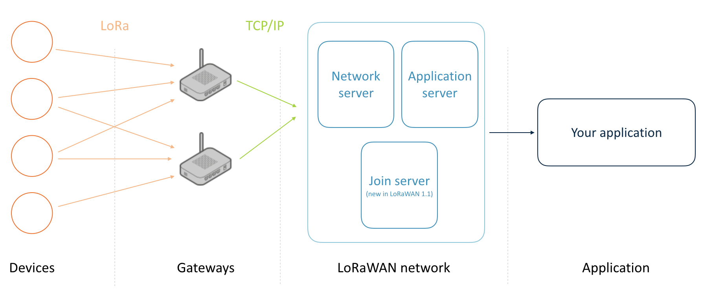
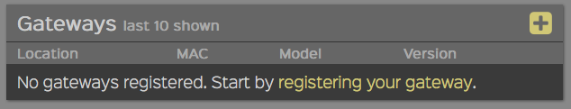
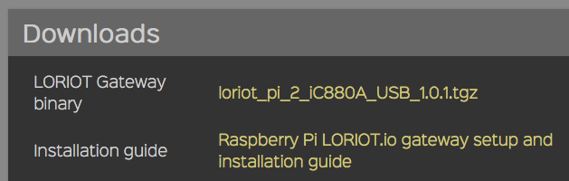
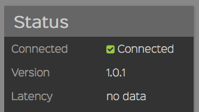

# Building your own LoRa network

There is a lot of buzz around [LoRa](https://www.lora-alliance.org), a wide-area network solution that promises kilometers of range with very low power consumption; a perfect fit for the Internet of Things. A number of telecom operators are currently rolling out networks, but because LoRa operates in the [open spectrum](https://en.wikipedia.org/wiki/ISM_band) you don't need to wait for them. In this article we'll go over all the pieces required to build a private LoRa network, and how to use the network to send data from an ARM mbed end-node to the cloud.

## Requirements

A typical LoRa network consists of four parts: devices, gateways, a network service and an application:



On the hardware side we need devices and gateways, similar to how we set up a WiFi network. Gateways are very simple: they just scan the spectrum and capture LoRa packets. There is also no gateway pinning here; all gateways within range of a device will receive the signal. The gateways then forward their data to a network service that handles the actual packet.

The network service de-duplicates data when multiple gateways receive the same packet, decrypts the message (everything is end-to-end encrypted), handles LoRa features like adaptive data rating, and so on. It then forwards the decrypted data to your application.

That gives us five requirements. We need hardware: gateways and devices; we need software: device firmware, a network service and an app. In this guide we'll show you which hardware you can buy, and we'll use two online services that will make it easy to write device firmware and handle your LoRa traffic.

### Getting a gateway

There's quite some [choice in the gateways](https://www.loriot.io/gateways.html) we can use, but I've had good experience with these three:

* [Kerlink IoT station](http://www.kerlink.fr/en/products/lora-iot-station-2/lora-iot-station-868-mhz). Expensive (around 1,200 euros), but great build quality and range.
* [Multitech Conduit](http://www.multitech.com/brands/multiconnect-conduit). About half the price of the Kerlink (around 550 euros), and pretty great for small setups (put a bigger antenna on it though).
* Building your own with a Raspberry Pi and an [IMST iC880A](http://www.wireless-solutions.de/products/long-range-radio/ic880a) concentrator. At around 300 euros, this is the most cost-efficient option.


*Self built LoRa gateway based on Raspberry Pi 2 and IMST iC880A. Total cost about 300 euros.*

For development purposes one gateway will be enough, but in a production deployment you'll want at least two, as there will always be dark spots in your network.

### Getting a device

We'll also need to build devices. If you want to use ARM mbed (and you should) there are two options:

* Get the [Multitech mDot](https://developer.mbed.org/platforms/MTS-mDot-F411/) and the [EVK board](http://www.digikey.com/product-detail/en/multi-tech-systems-inc/MTUDK2-ST-MDOT/591-1278-ND/5247463).
* Get the [SX1276MB1xAS](https://developer.mbed.org/components/SX1276MB1xAS/) shield, and a microcontroller that runs mbed (in this article I'm using the [nrf51-DK](https://developer.mbed.org/platforms/Nordic-nRF51-DK/), although most microcontrollers will work).

For both these options we have basic firmware already available, which we'll get to later in this document.

<span style="background-color:#E6E6E6;border:1px solid #000;display:block; height:100%; padding:10px">**Note:** When ordering hardware, always make sure that you get the variant that works in your region (for example 868 MHz in Europe, 915 MHz in the US).</span>

### Network server

Now on to the software side. We'll need a server that understands the LoRa protocol and can interpret the data being sent from the device. It's possible to roll your own (Semtech can give you their reference implementation if you sign an NDA), but there are also companies building LoRa Network Servers as a service, handling everything on your behalf. Today we'll be using such a service, from the Switzerland-based startup [LORIOT](https://loriot.io).

LORIOT is free for up to one gateway, and up to ten end-devices, which is good enough for evaluation purposes. Unfortunately the free plan has some limitations: it does not include bi-directional data (sending messages back from the cloud to a device) and over-the-air activation. But upgrading is relatively cheap (starting at 57 euros per month).

As a network server just processes your data - it doesn't store it - you'll need a place to store your messages as well. LORIOT allows you to hook into their service over a TCP socket or websocket and forward your data to the cloud service of your choice (or straight to your application).

## Setting up the gateway

We now need to configure our gateway by installing some software that will scan the spectrum and forward all LoRa packets to LORIOT. To do this we'll need to log into the gateway. Here are setup instructions for the three gateways mentioned earlier.

<span style="background-color:#E6E6E6;border:1px solid #000;display:block; height:100%; padding:10px">**Note:** This section assumes that you're familiar with SSH.</span>

### Kerlink IoT station

To configure the Kerlink:

1. Connect the gateway to your network over Ethernet.
1. The gateway gets an IP through DHCP.
1. To quickly find the gateway you can look in the DHCP table on your router, or use [nmap](http://nmap.org) via `nmap -p 22 192.168.2.*` (if that's your subnet).
1. You can now log into the gateway through SSH, with the username `root` and password `root`.

Often the Kerlink IoT station comes pre-configured with the packet forwarder (run `ps | grep pkt` to see if one is running). If this is the case, make sure the packet forwarder does not start on startup by removing the entry from `/etc/init.d`.

### Multitech Conduit

The Conduit is unfortunately configured with DHCP disabled, so we need to enable this first. There are two options: Ethernet and micro-USB.

__Using Ethernet__

1. Connect to the Conduit over Ethernet (from the Conduit to your computer).
1. Set a static IP address of 192.168.2.2 for your computer.
1. Set a static IP address of 192.168.2.1 as your router.
1. Log in through SSH to 192.168.2.1, with the username `root` and password `root`.


__Over micro-USB__

1. Connect to the Conduit using a micro-USB cable.
1. The gateway appears as a serial device.
1. You can use a program like [GNU screen](https://www.gnu.org/software/screen/) or [PuTTY](http://putty.org) to log into the gateway.

Now that we are connected we can set up the gateway:

1.  Enable DHCP by following Step 4 in [this document](http://www.multitech.net/developer/software/mlinux/getting-started-with-conduit-mlinux/).
1. Connect the gateway over Ethernet to your router.
1. Follow the steps under 'Kerlink IoT station' to find the IP address and log in over SSH.

### Raspberry Pi and IMST iC880A

First make sure that the Raspberry Pi is connected to the internet, and that you connected the IMST iC880A over USB (if you have the SPI version, take a look at the [IMST website](http://www.wireless-solutions.de/products/radiomodules/ic880a)).

Log into the Pi over SSH, and follow Steps 3.1 - 3.5 in [this document](http://www.wireless-solutions.de/images/stories/downloads/Radio%20Modules/iC880A/iC880A_QuickStartGuide.pdf).

<span style="background-color:#E6E6E6;border:1px solid #000;display:block; height:100%; padding:10px">**Note:** Use [lora_gateway 2.0.0](https://github.com/Lora-net/lora_gateway/releases/tag/v2.0.0), not the latest version (run `git checkout v2.0.0` in the lora_gateway folder).</span>

After following these steps:

1. Restart the Pi.
1. Run:

    ``~/LoRa/lora_gateway/lora_gateway/util_pkt_logger/util_pkt_logger``
    
1. You should see 'INFO: concentrator started, packet can now be received', which indicates that everything is functioning.

## Installing the LORIOT software

Now that we have set up the gateways and they can reach the internet, it's time to install the LORIOT software on them, so they have a place to send the LoRa packets.

1. [Sign up](https://eu1.loriot.io/register.html) for an account.
1. You're redirected to the dashboard page.
1. Click the link to register a new gateway.

    

1. You're now taken through a wizard. Just pick the gateway you have and follow the steps.
1. You're taken to the gateway page where you'll find the LORIOT binary for your platform, and a link to set up documentation.

    

    **Tip:** Use a tool like scp to copy the binary from your computer to the gateway. For example:

    ``scp ~/Downloads/loriot_pi_2_iC880A_USB_1.0.1.tar pi@192.168.2.7:~/``
    
1. The gateway now shows as connected on the LORIOT gateway page and we're ready to work on the device.



**Tip:** LORIOT has a 'Gateway Tap', which you can access from your gateway page. This allows you to see what messages are being picked up by the gateway - very useful when debugging.

## Building a device

Now off to the interesting work: building a device that can send sensor data over the LoRa network. For example, you can create a simple motion sensor using a [PIR sensor](https://www.adafruit.com/products/189) (under 10 euros at your local hardware store, and 2 euros when ordering from China). Of course, you are free to hook up a different sensor.


*PIR sensor hooked up to a Nordic Semiconductor nRF51-DK with a LoRa shield*

### Some notes on writing firmware

1. You cannot send data constantly because of duty cycle limitations. This is a requirement of using the open spectrum. If you send too quickly, sending will fail.
1. A disadvantage of the LoRa shield is that it blocks all the pins. You can solder some new headers on the back of the shield to add new peripherals, or use a microcontroller like the nRF51-DK that has the pins available twice, once through hole connectors and once through female headers.

### Registering the device on LORIOT

LoRa is end-to-end encrypted, with two sets of keys. We'll need to program these keys, plus a device ID, into the device firmware. We use these keys to sign our messages and be verified by the network server.

To generate a new key pair:

1. Go to the LORIOT dashboard.
1. Click *Applications > Sample App > Manage Devices > Generate New Device*.
1. A device is added to the list.
1. Click the device to go to the device page.
1. At the bottom of the page, find *Seqno checking* and change this setting to *Relax* (call `setRelax()` from the JS console if the button does not show up).


Now that we have the keys we can start writing some software.

### Using the LoRa shield


#### Importing the boilerplate program into the online IDE

1. [Sign up](https://developer.mbed.org/account/signup/?next=%2F) for an account on ARM mbed, which hosts the online compiler we'll be using.
1. Find your microcontroller on [the Platforms page](https://developer.mbed.org/platforms/).
1. Click *Add to your mbed compiler*.
1. Go to [LoRaWAN-lmic-app](https://developer.mbed.org/teams/Semtech/code/LoRaWAN-lmic-app/).
1. Click *Import this program*.
1. You're redirected to the online compiler, where you can give the program a name.


<span style="background-color:#E6E6E6;border:1px solid #000;display:block; height:100%; padding:10px">**Note:** Make sure that you select the right board in the top right corner of the compiler.</span>


#### Setting shield frequency

We need to set the right frequency for the version of the shield you have (and where you are in the world).

Open ``LMiC/lmic.h``, and find the following lines:

```
// mbed compiler options
//#define CFG_eu868                                   1
#define CFG_us915                                   1
```

Make sure the right line is uncommented, depending on the shield version that you have.


#### Adding LORIOT keys

Now let's program the keys from LORIOT into the device firmware.

Open ``main.cpp``, and change the following lines:

```cpp
#define LORAWAN_DEV_ADDR                            ( uint32_t )0x12345678

static uint8_t NwkSKey[] =
{
    0x2B, 0x7E, 0x15, 0x16, 0x28, 0xAE, 0xD2, 0xA6,
    0xAB, 0xF7, 0x15, 0x88, 0x09, 0xCF, 0x4F, 0x3C
};

// application session key
static uint8_t ArtSKey[] =
{
    0x2B, 0x7E, 0x15, 0x16, 0x28, 0xAE, 0xD2, 0xA6,
    0xAB, 0xF7, 0x15, 0x88, 0x09, 0xCF, 0x4F, 0x3C
};
```

* Set `LORAWAN_DEV_ADDR` to the *big endian* DevAddr from LORIOT.
* Set `NwkSKey` and `ArtSKey` to the NWKSKEY and APPSKEY from LORIOT, but turn them into hex numbers. For example, a LORIOT key of `5ADA30AA` should be `0x5A, 0xDA, 0x30, 0xAA` in your code.


#### Verifying our setup

Now we can verify whether our setup works, by clicking the *Compile* button.


When compilation succeeds a file is downloaded.

Plug your development board into the computer (over micro-USB) to mount it as a USB mass storage device. In most cases no drivers should be needed, but they are [here](https://developer.mbed.org/handbook/Windows-serial-configuration) just in case.

Once the device mounts, drag the compiled file onto the board. This causes the device to boot up. You can then see messages coming in to the LORIOT device page:


#### Switching to manual sending

By default the application sends data automatically. If you want to change this, remove these lines from ``main.cpp``:

```cpp
if( txOn == true )
{
    //Sends frame every APP_TX_DUTYCYCLE +/- APP_TX_DUTYCYCLE_RND random time (if not duty cycle limited)
    os_setTimedCallback( &sendFrameJob,
                         os_getTime( ) + ms2osticks( APP_TX_DUTYCYCLE + randr( -APP_TX_DUTYCYCLE_RND, APP_TX_DUTYCYCLE_RND ) ),
                         onSendFrame );

    ////Sends frame as soon as possible (duty cycle limitations)
    //onSendFrame( NULL );
}
```

You can now add code that sends a message whenever you want it to, for example when an interrupt fires because someone moves in front of your PIR sensor. For example:

```cpp
InterruptIn pir(D5);

static void prepareTxFrame( void )
{
    LMIC.frame[0] = pir; // current state of the pir sensor
#if ( LORAWAN_CONFIRMED_MSG_ON == 1 )
    LMIC.frame[1] = LMIC.seqnoDn >> 8;
    LMIC.frame[2] = LMIC.seqnoDn;
    LMIC.frame[3] = LMIC.rssi >> 8;
    LMIC.frame[4] = LMIC.rssi;
    LMIC.frame[5] = LMIC.snr;
#endif
}

void movement() {
    onSendFrame(NULL);
}

void no_movement() {
    onSendFrame(NULL);
}

int main( void ) {

    pir.rise(movement);
    pir.fall(no_movement);

    // ... lora related things
}
```

Change the content of the `prepareTxFrame` function to change which data you're sending (also update `LORAWAN_APP_DATA_SIZE`). Now we'll get a message whenever the PIR sensor changes state (from motion to no-motion and the other way around).

### Using the Multitech mDot


#### Importing the boilerplate program into the online IDE

1. [Sign up](https://developer.mbed.org/account/signup/?next=%2F) for an account on ARM mbed, which hosts the online compiler we'll be using.
1. Go to the [Multitech mDot platform page](https://developer.mbed.org/platforms/MTS-mDot-F411/).
1. Click *Add to your mbed compiler*.
1. Go to the [mdot_personalized_activation](https://developer.mbed.org/users/janjongboom/code/mdot_personalized_activation/) project page.
1. Click *Import this program*.
1. You're redirected to the online compiler where you can give the program a name.


<span style="background-color:#E6E6E6;border:1px solid #000;display:block; height:100%; padding:10px">**Note:** Make sure that you select the right board in the top right corner of the compiler.</span>


#### Adding LORIOT keys

Now let's program the keys from LORIOT into the device firmware.

Open ``main.cpp``, and copy the big endian DevAddr and the `APPSKEY` and `NWKSKEY`'s from LORIOT into the application:

```cpp
static const char LORIOT_DEV_ADDR[]  = "AABBCCDD"; // Use the big endian version here
static const char LORIOT_NWK_S_KEY[] = "E8A25EBD07F85800E08478A041FACBA7"; // NWKSKEY
static const char LORIOT_APP_S_KEY[] = "BE8EF84E745D0AB14D4507B0BA600555"; // APPSKEY
```

#### Verifying our setup

Now we can verify whether our setup works, by clicking the *Compile* button.


When compilation succeeds a file is downloaded.

Plug your development board into the computer (over micro-USB) to mount it as a USB mass storage device. In most cases no drivers should be needed, but they are [here](https://developer.mbed.org/handbook/Windows-serial-configuration) just in case.

Once the device mounts, drag the compiled file onto the board. This causes the device to boot up. You can then see messages coming in to the LORIOT device page:


#### Switching to manual sending

By default the application sends data automatically. If you want to change this, you can remove the `send_data();` call, and call it manually (for example from an interrupt). See the section above about the LoRa shield for more information.

## Building a web application

Now that we have the first three parts of our network up and running, it's time to use the sensor data in a small application. LORIOT offers a number of ways of getting your data out of their service, but the easiest is using a websocket. We can write a quick web application that will turn the page red when movement is detected, and green when everything is OK. We do this by checking the first byte of the LoRa payload (1=movement, 0=no movement).

1. In LORIOT: go to your dashboard and click *Applications > Sample App > Output*.
1. Change the output type to *WebSocket*.

    

1. Copy the URL and the token under *Current output setup* and paste them in the code sample below:

    

```html
<!DOCTYPE html>
<html>
<head>
    <title>PIR Sensor monitoring!</title>
</head>
<body>
    <p id="status">Connecting...</p>
    <script>
    var token = 'YOUR_AUTHENTICATION_TOKEN_HERE';
    var url = 'YOUR_TARGET_URL_HERE (incl {token} part)';
    var ws = new WebSocket(url.replace('{token}', token));
    ws.onopen = function() {
        document.querySelector('#status').textContent = 'Connected';
    };
    ws.onclose = function() {
        document.querySelector('#status').textContent = 'Disconnected';
    };
    ws.onmessage = function(e) {
        console.log('onmessage', e);
        var data = JSON.parse(e.data);
        if (data.cmd !== 'rx') return;

        switch (Number(data.data.slice(0, 2))) {
            case 0: document.body.style.backgroundColor = 'green'; break;
            case 1: document.body.style.backgroundColor = 'red'; break;
        }
    };
    </script>
</body>
</html>
```

And done! We now have a fully functioning LoRa network with a device, a gateway and a web application:


## Conclusion

LoRa is a great technology with a lot of potential, especially because anyone can set up a network and get started building long range IoT devices with a relatively small investment. I hope that this guide will help you get started, and would love to see what you build with LoRa and ARM mbed!

---

*[Jan Jongboom](http://twitter.com/janjongboom) is Developer Evangelist IoT at ARM, and a vivid LoRa enthusiast.*
