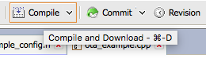
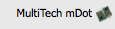

# Building your own private LoRa network

There is a lot of buzz about [LoRa](https://www.lora-alliance.org), a wide-area network solution that promises kilometers of range with very low power consumption, a perfect fit for the Internet of Things. Telecom operators are rolling out LoRa networks, but because LoRa operates in the [open spectrum](https://en.wikipedia.org/wiki/ISM_band), you can also set up your own network. This article discusses the requirements to build a private LoRa network and how to use the network to send data from an ARM mbed end-node to the cloud.

<span class="notes">**Note on LoRa vs. LoRaWAN:** Technically, we're building a LoRaWAN network in this article. LoRa is the modulation technique used (PHY), and LoRaWAN is the network protocol on top of the physical layer (MAC).</span>

## Requirements

A typical LoRa network consists of four parts: devices, gateways, a network service and an application:

<span class="images"><span>Topology of a LoRa network</span></span>

For hardware, you need devices and gateways, similar to how you would set up a Wi-Fi network. Gateways are simple: they just scan the spectrum and capture LoRa packets. There is no gateway pinning here - devices are not associated with a single gateway; thus, all gateways within range of a device receive the signal. The gateways then forward their data to a network service that handles the packet.

The network service deduplicates packets when multiple gateways receive the same packet, decrypts the message (everything is end-to-end encrypted), handles LoRa features such as adaptive data rating and so on. It then forwards the decrypted data to your application. Often, network service providers allow you to run parts of the network - like the application server, which decrypts the messages - yourself.

There are five requirements.

We need hardware:

* Gateways.
* Devices.

And we need software:

* Device firmware.
* A network service.
* An app.

This guide shows you which hardware you can buy and two online services you can use to write device firmware and handle your LoRa traffic.

Note that the frequency that LoRa uses differs per region. Make sure you get gateways and devices that are legal in your jurisdiction. For example, use 915 MHz radios in the United States, and an 868 MHz radio in Europe. More information can be found in the [LoRaWAN regional parameters](http://net868.ru/assets/pdf/LoRaWAN-Regional-Parameters-v1.1rA.PDF) specification.

### Getting a gateway

You have [a lot of choices in the gateways](https://www.loriot.io/lora-gateways.html) you can use, but we've had good experience with these three:

* [Kerlink Wirnet station](https://www.kerlink.com/product/wirnet-station/). Expensive (around 1,200 euros) but great build quality and range.
* [Multi-Tech Conduit](http://www.multitech.com/brands/multiconnect-conduit). About one-third of the price of the Kerlink (about 450 euros) and good for smaller setups. Multi-Tech also has a [rugged outdoor](http://www.multitech.com/brands/multiconnect-conduit-ip67) version. Make sure you also order the LoRa mCard.
* Building your own with a Raspberry Pi and an [IMST iC880A](http://shop.imst.de/wireless-modules/lora-products/8/ic880a-spi-lorawan-concentrator-868-mhz) concentrator. At about 150 euros, this is a cost-efficient option.

<span class="images"><span>Self-built LoRa gateway based on Raspberry Pi 2 and IMST iC880A. Total cost is about 150 euros.</span></span>

For development purposes, one gateway is enough, but in a production deployment, you need at least two because there will always be dark spots in your network.

<span class="images"><span>Kerlink Wirnet station overlooking the Oslo fjord.</span></span>

### Getting a device

You also need to build devices. If you use ARM mbed (and you should), you can either use:

* A development board with a LoRa transceiver:
    * [L-TEK FF1705](https://os.mbed.com/platforms/L-TEK-FF1705/).
    * [Multi-Tech xDot](https://developer.mbed.org/platforms/MTS-xDot-L151CC/).
    * [Multi-Tech mDot](https://developer.mbed.org/platforms/MTS-mDot-F411/) and the [UDK2 board](http://www.digikey.com/product-detail/en/multi-tech-systems-inc/MTUDK2-ST-MDOT/591-1278-ND/5247463).
    * [Multi-Tech mDot EVB](https://developer.mbed.org/platforms/mdotevb/).
    * [B-L072Z-LRWAN1 LoRa®Discovery kit](https://os.mbed.com/platforms/ST-Discovery-LRWAN1/).
* An Mbed OS 5-enabled development board together with a LoRa shield:
    * [SX1272MB2xAS](https://developer.mbed.org/components/SX1272MB2xAS/) - shield based on the SX1272 transceiver.
    * [SX1276MB1xAS](https://developer.mbed.org/components/SX1276MB1xAS/) - shield based on the SX1276 transceiver.

This document contains instructions for the Multi-Tech mDot and the [Nordic Semiconductors nRF51-DK](https://developer.mbed.org/platforms/Nordic-nRF51-DK/)+SX1276MB1xAS shield, but the same principles apply to all other combinations.

<span class="notes">**Note:** When ordering hardware, always make sure you get the variant that works in your region (for example 868 MHz in Europe, 915 MHz in the US).</span>

### Network server

Now on to the software side. You need a server that understands the LoRa protocol and can interpret the data the device sends. It's possible to roll your own (Semtech can give you its reference implementation if you sign an NDA), but there are also companies building LoRa network servers as a service, handling everything on your behalf. This article uses [The Things Network](https://www.thethingsnetwork.org), an open source, globally distributed network service that also has a free hosted plan.

Because a network server only processes your data and doesn't store it, you need a place to store your messages, as well. The Things Network allows you to hook into their service through an MQTT client and forward your data to the cloud service of your choice (or straight to your application).

## Setting up the gateway

You now need to configure the gateway by installing software that scans the spectrum and forwards all LoRa packets to the network server. To do this, you will need to log into the gateway. Below are setup instructions for the three gateways suggested earlier.

<span class="notes">**Note:** This section assumes that you're familiar with SSH.</span>

### Kerlink IoT station

To configure the Kerlink:

1. Connect the gateway to your network over Ethernet.
1. The gateway gets an IP through DHCP.
1. To quickly find the gateway, look in the DHCP table on your router or use [nmap](http://nmap.org) via `nmap -p 22 192.168.2.*` (if that's your subnet).
1. You can now log into the gateway through SSH with the username `root` and password `root` (if using 2.x firmware) or `pdmk-0` followed by the last seven numbers of the gateway's serial number (if using 3.x firmware).

### MultiTech Conduit

The Conduit is configured with DHCP disabled, so you need to enable this first. There are two options to do this: either via Ethernet or via micro-USB.

__Using Ethernet__

1. Connect to the Conduit over Ethernet (from the Conduit to your computer).
1. Set a static IP address of 192.168.2.2 for your computer.
1. Set a static IP address of 192.168.2.1 as your router.
1. Log in through SSH to 192.168.2.1 with the username `root` and password `root`.


__Over micro-USB__

1. Connect to the Conduit using a micro-USB cable.
1. The gateway appears as a serial device.
1. You can use a program such as [GNU screen](https://www.gnu.org/software/screen/) or [PuTTY](http://putty.org) to log into the gateway with the username `root` and password `root`.

<span class="notes">**Note when logging in fails:** If logging in as `root` fails, but you can log in with the username `admin` and the password `admin`, you are running the AEP firmware. To proceed, update your gateway firmware to mLinux. Instructions are [here](http://www.multitech.net/developer/software/mlinux/using-mlinux/flashing-mlinux-firmware-for-conduit/).</span>

Now that you are connected, you can set up the gateway:

1.  Enable DHCP by following Step 4 in [this document](http://www.multitech.net/developer/software/mlinux/getting-started-with-conduit-mlinux/).
1. Connect the gateway over Ethernet to your router.
1. Verify that the gateway is connected to the internet (for example, by running `ping 8.8.4.4`).

### Raspberry Pi and IMST iC880A

First, make sure that the Raspberry Pi is connected to the internet and that you connected the IMST iC880A over USB. (If you have the SPI version, look at the [IMST website](http://www.wireless-solutions.de/products/radiomodules/ic880a)).

Log into the Pi over SSH, and follow Steps 3.1 - 3.5 in [this document](http://www.wireless-solutions.de/images/stories/downloads/Radio%20Modules/iC880A/iC880A_QuickStartGuide.pdf).

<span class="notes">**Note:** Use [lora_gateway 2.0.0](https://github.com/Lora-net/lora_gateway/releases/tag/v2.0.0), not the latest version. (Run `git checkout v2.0.0` in the lora_gateway folder).</span>

After following these steps:

1. Restart the Pi.
1. Run:

    ``~/LoRa/lora_gateway/lora_gateway/util_pkt_logger/util_pkt_logger``

1. You see 'INFO: concentrator started, packet can now be received', which indicates that everything is functioning.

## Setting up the network server

Now that you have set up the gateways and they can reach the internet, it's time to install the The Things Network software on them, so they have a place to send the LoRa packets.

<span class="notes">**Note on the Kerlink IoT station:** Often, the Kerlink IoT station comes preconfigured with the packet forwarder (run `ps | grep pkt` to see if one is running). If this is the case, make sure the packet forwarder does not start on startup by removing the entry from `/etc/init.d`.</span>

### Registering the gateway

1. [Sign up](https://console.thethingsnetwork.org) for an account.
1. You're redirected to the dashboard page.
1. Click *Gateways*.

    <span class="images"></span>

1. Click *Add a new gateway*.

    <span class="images"></span>

1. Fill in the details of your gateway.

    <span class="images"><span>Gateway details, make sure the location is set correctly so coverage maps can be updated.</span></span>

1. Click *Register gateway*.
1. The gateway is now created, to authenticate the gateway you need the 'Gateway key'. Copy it.

    <span class="images"></span>

### Installing the packet forwarder

**Kerlink IoT station**

??

**Multi-Tech Conduit**

1. On the gateway run:

    ```
    $ wget https://github.com/kersing/multitech-installer/raw/master/installer.sh
    $ sh installer.sh
    ```

1. A wizard starts. Answer the questions.

    <span class="images"><span>Wizard for configuring the Multi-Tech Conduit</span></span>.

1. After the gateway reboots, log back in.
1. Then run (again):

    ```
    $ sh installer.sh
    ```

1. And fill in the remaining questions.

    <span class="images"><span>Wizard (2) for configuring the Multi-Tech Conduit</span></span>.

1. After this the gateway should show as 'Connected' in the TTN console.

    <span class="images"><span>Connected!</span></span>

**Raspberry Pi + IMST iC880A**

???

<span class="tips">**Tip:** TTN has a 'Traffic' tab, which you can access from your gateway page. This allows you to see what messages the gateway is picking up, which is useful when debugging.</span>

### Automatically starting the LORIOT binary when the gateway starts

#### Kerlink IoT station

If you followed the installation steps in the LORIOT documentation, the binary automatically starts whenever the gateway boots.

#### MultiTech Conduit

1. Log in over SSH or via the serial port.
1. Create a new file `/etc/init.d/start-loriot.sh`.
1. Edit this file (via `nano /etc/init.d/start-loriot.sh`), and add the following content:

    ``cd /home/root/ && ./loriot_multitech_conduit_mCard_USB_1.0.1``

    * If you extracted the LORIOT binary somewhere else, edit the path.
    * CD into the folder first; otherwise, LORIOT cannot find its certificate.

1. Make the file executable: `chmod +x /etc/init.d/start-loriot.sh`
1. Link the script: `ln -s /etc/init.d/start-loriot.sh /etc/rc5.d/S99start-loriot.sh`
1. Now, reboot the gateway, and verify that the LORIOT binary is running (via `ps aux | grep loriot`).

#### Raspberry Pi and IMST iC880A

Follow the steps on [this page](http://raspberrypi.stackexchange.com/questions/8734/execute-script-on-start-up) to start the LORIOT binary when the Raspberry Pi starts up.

## Building a device

Now to the interesting work: building a device that can send sensor data over the LoRa network. For example, you can create a motion sensor using a [PIR sensor](https://www.adafruit.com/products/189) (less than 10 euros at your local hardware store and 2 euros when ordering from China). Of course, you can use any other sensor.

<span class="images"><span>PIR sensor hooked up to a Nordic Semiconductor nRF51-DK with a SX1276 LoRa shield</span></span>

### Some notes on writing firmware

#### Sending data constantly

You cannot send data constantly because of duty cycle limitations. This is a requirement of using the open spectrum. If you send too quickly, sending will fail. How fast you are allowed to send depends on the spread factor that you use. With a higher spread factor, it takes longer to send a message - though the chance that it will be received by a gateway increases. Thus, you need to wait longer before you can send again. During development, you can set the spread factor to SF7 (the lowest), so you can send every 6-7 seconds.

LoRaWAN has a feature called Adaptive Data Rating (ADR), through which the network can control the spread factor. You probably want this enabled.

#### Blocking pins

A disadvantage of the SX1276 LoRa shield is that it blocks a lot of pins. You can solder some new headers on the back of the shield to add new peripherals, or use a microcontroller like the nRF51-DK or a NUCLEO board that has more pins available than just the Arduino headers.

## Registering the device on The Things Network

LoRaWAN uses an end-to-end encryption scheme that uses two session keys. One key is held by the network server, and another one is held by the application server (in this tutorial TTN fulfills both roles). These session keys are created when the device joins the network. For the initial authentication with the network the application needs its device EUI, the application EUI of the application it wants to join, and a pre-shared key (the application key).

The device EUI and application EUI are globally unique identifiers. You can buy a block of EUIs from the [IEEE](http://standards.ieee.org/develop/regauth/tut/eui.pdf). If you're using a module it often already has an EUI printed on the module. If you're using a radio shield you can use an EUI from The Things Network's block.

<span class="notes">**Note:** In LoRaWAN 1.1 the application key is replaced by the join key, and the initial authentication is handled by the join server. However, at the time of writing this is not implemented on The Things Network.</span>

Let's register the device in The Things Network and generate some keys:

1. Go to The Things Network console.
1. Click *Applications*.
1. Click *Create new application*.


LoRa is end-to-end encrypted, with two sets of keys. You'll need to program these keys and a device ID into the device firmware. You'll use these keys to sign messages and be verified by the network server.

To generate a new key pair:

1. Go to the LORIOT dashboard.
1. Click *Applications > Sample App > Manage Devices > Generate New Device*.
1. A device is added to the list.
1. Click the device to go to the device page.
1. At the bottom of the page, find *Seqno checking*, and change this setting to *Relax*. (Call `setRelax()` from the JS console if the button does not show up).

<span class="images"><span>Disabling strict sequence number checking</span></span>

Now that you have the keys, you can start writing software.

### Using the LoRa shield


#### Importing the boilerplate program into the online IDE

1. [Sign up](https://developer.mbed.org/account/signup/?next=%2F) for an account on ARM mbed, which hosts the Online Compiler you'll be using.
1. Find your microcontroller on [the Platforms page](https://developer.mbed.org/platforms/).
1. Click *Add to your mbed compiler*.
1. Go to [LoRaWAN-lmic-app](https://developer.mbed.org/teams/Semtech/code/LoRaWAN-lmic-app/).
1. Click *Import this program*.
1. You're redirected to the Online Compiler, where you can give the program a name.


	<span class="images"><span>Importing a program to get started</span></span>

<span class="notes">**Note:** Make sure that you select the correct board in the top right corner of the compiler.</span>

<span class="images"><span>Selecting the correct board</span></span>


#### Setting shield frequency

You need to set the correct frequency for the version of the shield you have (and where you are in the world).

Open ``LMiC/lmic.h``, and find the following lines:

```cpp
// mbed compiler options
//#define CFG_eu868                                   1
#define CFG_us915                                   1
```

Make sure the correct line is uncommented, depending on the shield version that you have.

__If you have the SX1276MB1LAS:__

```cpp
//#define CFG_eu868                                   1
#define CFG_us915                                   1
```

__If you have the SX1276MB1MAS:__

```cpp
#define CFG_eu868                                   1
//#define CFG_us915                                   1
```

#### Adding LORIOT keys

Program the keys from LORIOT into the device firmware.

<span class="images"><span>Copying the address and the keys from LORIOT into the device firmware</span></span>

Open `main.cpp`, and change the following lines:

```cpp
#define LORAWAN_DEV_ADDR                            ( uint32_t )0x12345678

static uint8_t NwkSKey[] =
{
    0x2B, 0x7E, 0x15, 0x16, 0x28, 0xAE, 0xD2, 0xA6,
    0xAB, 0xF7, 0x15, 0x88, 0x09, 0xCF, 0x4F, 0x3C
};

// application session key
static uint8_t ArtSKey[] =
{
    0x2B, 0x7E, 0x15, 0x16, 0x28, 0xAE, 0xD2, 0xA6,
    0xAB, 0xF7, 0x15, 0x88, 0x09, 0xCF, 0x4F, 0x3C
};
```

* Set `LORAWAN_DEV_ADDR` to the *big endian* DevAddr from LORIOT (green), prefixed with `0x`.
* Set `NwkSKey` and `ArtSKey` to the NWKSKEY (orange) and APPSKEY (yellow) from LORIOT, but turn them into hex numbers. For example, a LORIOT key of `5ADA30AA` should be `0x5A, 0xDA, 0x30, 0xAA` in your code.


#### Verifying the setup

Now you can verify whether the setup works by clicking the *Compile* button.

<span class="images"><span>Compile button</span></span>

When compilation succeeds, a file is downloaded.

Plug your development board into the computer (over micro-USB) to mount it as a USB mass storage device. In most cases, you should not need a driver, but you can find drivers [here](https://docs.mbed.com/docs/debugging-on-mbed/en/latest/Debugging/printf/) just in case.

Once the device mounts, drag the compiled file onto the board. This causes the device to boot up. You can then see messages coming in to the LORIOT device page:

<span class="images"><span>We've got data!</span></span>

#### Switching to manual sending

By default, the application sends data automatically. If you want to change this, remove these lines from `main.cpp`:

```cpp
if( txOn == true )
{
    //Sends frame every APP_TX_DUTYCYCLE +/- APP_TX_DUTYCYCLE_RND random time (if not duty cycle limited)
    os_setTimedCallback( &sendFrameJob,
                         os_getTime( ) + ms2osticks( APP_TX_DUTYCYCLE + randr( -APP_TX_DUTYCYCLE_RND, APP_TX_DUTYCYCLE_RND ) ),
                         onSendFrame );

    ////Sends frame as soon as possible (duty cycle limitations)
    //onSendFrame( NULL );
}
```

You can now add code that sends a message whenever you want it to, for example when an interrupt fires because someone moves in front of the PIR sensor:

```cpp
InterruptIn pir(D5);

static void prepareTxFrame( void )
{
    LMIC.frame[0] = pir; // current state of the pir sensor
#if ( LORAWAN_CONFIRMED_MSG_ON == 1 )
    LMIC.frame[1] = LMIC.seqnoDn >> 8;
    LMIC.frame[2] = LMIC.seqnoDn;
    LMIC.frame[3] = LMIC.rssi >> 8;
    LMIC.frame[4] = LMIC.rssi;
    LMIC.frame[5] = LMIC.snr;
#endif
}

void movement() {
    onSendFrame(NULL);
}

void no_movement() {
    onSendFrame(NULL);
}

int main( void ) {

    pir.rise(movement);
    pir.fall(no_movement);

    // ... lora related things
}
```

Change the content of the `prepareTxFrame` function to change which data you're sending (also update `LORAWAN_APP_DATA_SIZE`). You get a message whenever the PIR sensor changes state (from motion to no-motion and the other way around).

### Using the MultiTech mDot


#### Importing the boilerplate program into the online IDE

1. [Sign up](https://developer.mbed.org/account/signup/?next=%2F) for an account on ARM mbed, which hosts the Online Compiler you'll use.
1. Go to the [MultiTech mDot platform page](https://developer.mbed.org/platforms/MTS-mDot-F411/).
1. Click *Add to your mbed compiler*.
1. Go to the [mdot_personalized_activation](https://developer.mbed.org/users/janjongboom/code/mdot_personalized_activation/) project page.
1. Click *Import this program*.
1. You're redirected to the Online Compiler, where you can give the program a name.

<span class="images"><span>Importing a program to get started</span></span>

<span class="notes">**Note:** Make sure that you select the correct board in the top right corner of the compiler.</span>

<span class="images"><span>Selecting the correct board</span></span>

#### Adding LORIOT keys

Now, program the keys from LORIOT into the device firmware.

<span class="images"><span>Copying the address and the keys from LORIOT into the device firmware</span></span>

Open `main.cpp`, and copy the big endian `DevAddr` (green), the `NWKSKEY` (orange) and the `NWKSKEY` (yellow) from LORIOT into the application:

```cpp
static const char LORIOT_DEV_ADDR[]  = "AABBCCDD"; // green
static const char LORIOT_NWK_S_KEY[] = "E8A25EBD07F85800E08478A041FACBA7"; // orange
static const char LORIOT_APP_S_KEY[] = "BE8EF84E745D0AB14D4507B0BA600555"; // yellow
```

#### Verifying the setup

Now you can verify whether the setup works by clicking the *Compile* button.

<span class="images"><span>Compile button</span></span>

When compilation succeeds, a file is downloaded.

Plug your development board into the computer (over micro-USB) to mount it as a USB mass storage device. In most cases, you don't need a driver, but you can find drivers [here](https://docs.mbed.com/docs/debugging-on-mbed/en/latest/Debugging/printf/) just in case.

Once the device mounts, drag the compiled file onto the board. This causes the device to boot up. You can then see messages coming in to the LORIOT device page:

<span class="images"><span>We've got data!</span></span>

#### Switching to manual sending

By default, the application sends data automatically. If you want to change this, remove the `send_data();` call, and call it manually (for example from an interrupt). See the [section above about the LoRa shield](#using-the-lora-shield) for more information.

## Building a web application

Now that the first three parts of the network are working, it's time to use the sensor data in a small application. LORIOT offers ways to get your data out of its service, but the easiest is using a websocket. You can write a web application that turns the page red when movement is detected and green when everything is OK. You do this by checking the first byte of the LoRa payload (1=movement, 0=no movement).

1. In LORIOT: go to your dashboard, and click *Applications > Sample App > Output*.
1. Change the output type to *WebSocket*.

	<span class="images"><span>Websocket</span></span>

1. Copy the URL and the token under *Current output setup*, and paste them in the code sample below:

	<span class="images"><span>Retrieving the API parameters from the output tab in LORIOT</span></span>

```html
<!DOCTYPE html>
<html>
<head>
    <title>PIR Sensor monitoring!</title>
</head>
<body>
    <p id="status">Connecting...</p>
    <script>
    var token = 'YOUR_AUTHENTICATION_TOKEN_HERE';
    var url = 'YOUR_TARGET_URL_HERE (incl {token} part)';
    var ws = new WebSocket(url.replace('{token}', token));
    ws.onopen = function() {
        document.querySelector('#status').textContent = 'Connected';
    };
    ws.onclose = function() {
        document.querySelector('#status').textContent = 'Disconnected';
    };
    ws.onmessage = function(e) {
        console.log('onmessage', e);
        var data = JSON.parse(e.data);
        if (data.cmd !== 'rx') return;

        switch (Number(data.data.slice(0, 2))) {
            case 0: document.body.style.backgroundColor = 'green'; break;
            case 1: document.body.style.backgroundColor = 'red'; break;
        }
    };
    </script>
</body>
</html>
```

You now have a fully functioning LoRa network with a device, a gateway and a web application:

<span class="images"><span>Full circle</span></span>

## Conclusion

LoRa is a great technology with a lot of potential, especially because anyone can set up a network and start building long-range IoT devices with a relatively small investment. We hope this guide helped you get started, and we would love to see what you build with LoRa and ARM mbed!
