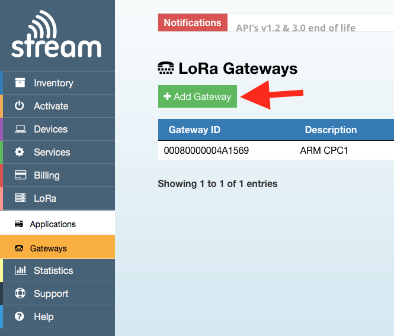
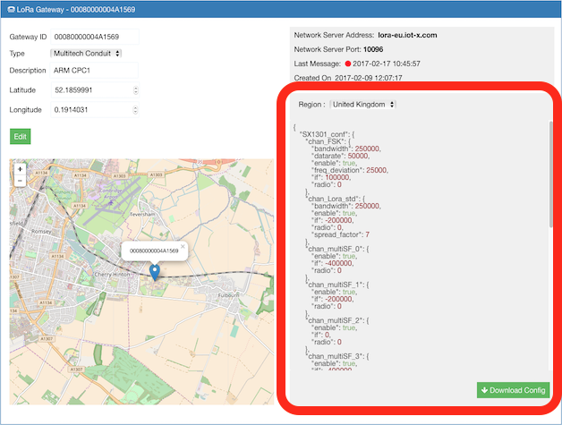
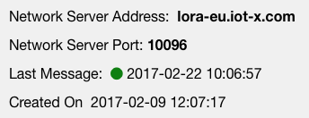
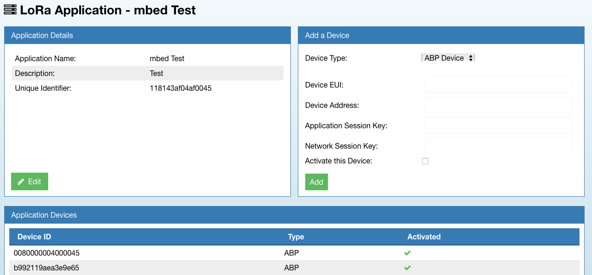
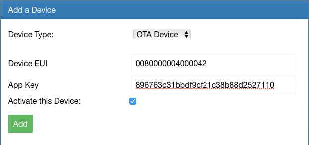
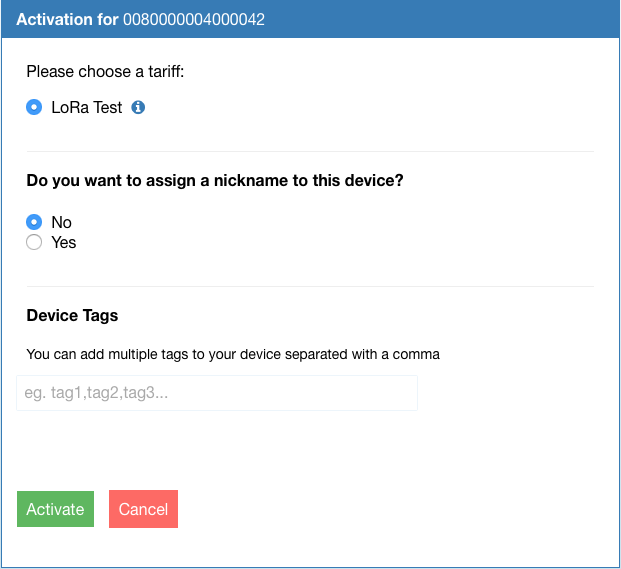
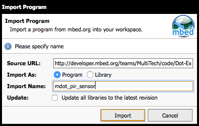
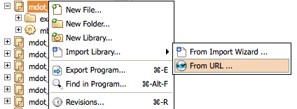
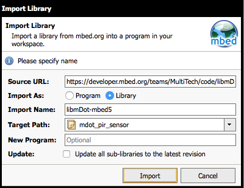
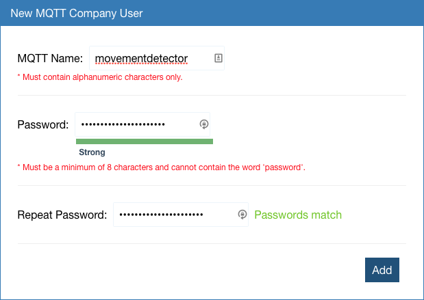

# Setting up your LoRa network on IoT-X

If you haven't done so, read [Building your own private LoRa network](intro-to-lora.md) first.

Now that we have set up the gateways and they can reach the internet, it's time to install and configure the LoRa packet forwarder on them, so they have a place to send the LoRa packets.

## Installing the LoRa packet forwarder

The [LoRa packet forwarder](https://github.com/Lora-net/packet_forwarder) is an open-source application that runs on a gateway and forwards captured LoRa packets to a host of your choice. We can install the packet forwarder and configure it to send its data to IoT-X.

To install the packet forwarder follow these instructions:

### Kerlink IoT station

The Kerlink IoT station comes with the packet forwarder installed. Run `ps | grep pkt` to verify whether it's already running. You can find the location of the packet forwarder via `find / -name global_conf.json`.

### Multitech Conduit

Follow the steps in [this document](https://www.multitech.net/developer/software/lora/conduit-mlinux-convert-to-basic-packet-forwarder/).

### Raspberry Pi and IMST iC880A

1. Clone the [Lora-net/packet_forwarder](https://github.com/Lora-net/packet_forwarder) repository.
1. Check out [v2.2.1](https://github.com/Lora-net/packet_forwarder/commit/28df8c0655bbf6d5d5b62d4e8e56c0c2e427558e) tag - `git checkout v2.2.1`.
1. In the 'basic_pkt_fwd' folder, run `make` to build the packet forwarder.

## Configuring the LoRa packet forwarder

Next you'll need a configuration file for the packet forwarder, which you can retrieve from the IoT-X website.

1. [Log in](https://stream.iot-x.com/login) to your account.
1. You're redirected to the dashboard page.
1. In the left sidebar, click *Lora > Gateways*.
1. Click *Add Gateway* to register a new gateway.

    <span class="images"><span>First step to registering a new gateway</span></span>

1. You're now taken through a wizard. Follow the steps.
1. You're taken to the gateway page where you'll find the configuration file for your platform. Click *Download Config* to download the configuration file.

    <span class="images"><span>The configuration file</span></span>

1. On the gateway, in the packet forwarder directory, find the ``global_conf.json`` file and replace it with the download config.
1. (Re-)start the packet forwarder.
1. The gateway now shows as connected on the IoT-X gateway page and we're ready to work on the device.

    <span class="images"><span>Connected!</span></span>

## Building a device

Now off to the interesting work: building a device that can send sensor data over the LoRa network. For example, you can create a simple motion sensor using a [PIR sensor](https://www.adafruit.com/products/189) (under 10 euros at your local hardware store, and 2 euros when ordering from China). Of course, you are free to hook up a different sensor.

<span class="images"><span>PIR sensor hooked up to a Nordic Semiconductor nRF51-DK with a LoRa shield</span></span>

### Some notes on writing firmware

1. You cannot send data constantly because of duty cycle limitations. This is a requirement of using the open spectrum. If you send too quickly, sending will fail.
1. A disadvantage of the LoRa shield is that it blocks all the pins. You can solder some new headers on the back of the shield to add new peripherals, or use a microcontroller like the nRF51-DK that has the pins available twice, once through hole connectors and once through female headers.

### Registering the device on IoT-X

LoRa is end-to-end encrypted, with two sets of keys. We'll need to program these keys, plus a device ID, into the device firmware. We use these keys to sign our messages and be verified by the network server.

To generate a new key pair:

1. Go to the IoT-X dashboard.
1. Click *Applications*.
1. If you do not have an application yet, click *Create an application* and fill in the form.
1. Click on application name to go to the application overview.

    <span class="images"><span>Application overview</span></span>

1. In the 'Add a device' form, under 'Device Type' choose 'OTA'.
1. In the 'Add a device' form, under 'Device EUI' enter:
    * If your device has a sticker which says 'EUI' (all Multitech devices), enter this EUI.
    * If your device does not have a sticker (all shields), [generate an 8-byte random number](https://www.random.org/cgi-bin/randbyte?nbytes=8&format=h) and enter this value (without spaces).
1. In the 'Add a device' form, under 'Device EUI' enter [a 16-byte random number](https://www.random.org/cgi-bin/randbyte?nbytes=16&format=h) (without spaces).
1. In the 'Add a device' form, under 'Activate this Device', enable the checkbox.
1. Click *Add*.

    <span class="images"><span>Adding a device</span></span>

1. Choose a Tariff and click *Activate*.

    <span class="images"><span>Activating a device</span></span>

1. The device is activated. Click on *LoRa > Applications > Your application name* to go back to the application overview.
1. Click on the device that you just created and note down the 'App EUI' and 'App Key'.

Now that we have the keys we can start writing some software.

### Using the LoRa shield


#### Importing the boilerplate program into the online IDE

1. [Sign up](https://developer.mbed.org/account/signup/?next=%2F) for an account on ARM mbed, which hosts the online compiler we'll be using.
1. Find your microcontroller on [the Platforms page](https://developer.mbed.org/platforms/).
1. Click *Add to your mbed compiler*.
1. Go to [LoRaWAN-lmic-app](https://developer.mbed.org/teams/Semtech/code/LoRaWAN-lmic-app/).
1. Click *Import this program*.
1. You're redirected to the online compiler, where you can give the program a name.


	<span class="images"><span>Importing a program to get started</span></span>

<span class="notes">**Note:** Make sure that you select the right board in the top right corner of the compiler.</span>

<span class="images"><span>Selecting the right board</span></span>


#### Setting shield frequency

We need to set the right frequency for the version of the shield you have (and where you are in the world).

Open ``LMiC/lmic.h``, and find the following lines:

```cpp
// mbed compiler options
//#define CFG_eu868                                   1
#define CFG_us915                                   1
```

Make sure the right line is uncommented, depending on the shield version that you have.

__If you have the SX1276MB1LAS:__

```cpp
//#define CFG_eu868                                   1
#define CFG_us915                                   1
```

__If you have the SX1276MB1MAS:__

```cpp
#define CFG_eu868                                   1
//#define CFG_us915                                   1
```

#### Adding IoT-X keys

Now let's program the keys from IoT-X into the device firmware. You'll need keys from both the 'Application' page and the 'Device' page.

<span class="images"><span>IoT-X application page</span></span>

<span class="images"><span>IoT-X device page</span></span>

Open ``main.cpp`` and set `OVER_THE_AIR_ACTIVATION` to `1`:

```cpp
#define OVER_THE_AIR_ACTIVATION                     1
```

Then, change the following lines:

```cpp
// application router ID (LSBF)
static const uint8_t AppEui[8] =
{
    0x00, 0x00, 0x00, 0x00, 0x00, 0x00, 0x00, 0x00
};

// unique device ID (LSBF)
static const u1_t DevEui[8] =
{
    0x01, 0x23, 0x45, 0x67, 0x89, 0xAB, 0xCD, 0xEF
};

// device-specific AES key (derived from device EUI)
static const uint8_t DevKey[16] =
{
    0x2B, 0x7E, 0x15, 0x16, 0x28, 0xAE, 0xD2, 0xA6,
    0xAB, 0xF7, 0x15, 0x88, 0x09, 0xCF, 0x4F, 0x3C
};
```

* Set `AppEui` to the application's 'Unique Identifier' (purple box).
* Set `DevEui` to the device's 'Device EUI' (green box).
* Set `DevKey` to the device's 'App Key' (red box).

<span class="notes">**Note:** Turn them into hex numbers. For example, a key of `5ADA30AA` should be `0x5A, 0xDA, 0x30, 0xAA` in your code.</span>


#### Verifying our setup

Now we can verify whether our setup works, by clicking the *Compile* button.

<span class="images"><span>Compile button</span></span>

When compilation succeeds a file is downloaded.

Plug your development board into the computer (over micro-USB) to mount it as a USB mass storage device. In most cases no drivers should be needed, but they are [here](https://developer.mbed.org/handbook/Windows-serial-configuration) just in case.

Once the device mounts, drag the compiled file onto the board. This causes the device to boot up. You can then see messages coming in to the IoT-X application page:

<span class="images"><span>We've got data!</span></span>

#### Switching to manual sending

By default the application sends data automatically. If you want to change this, remove these lines from ``main.cpp``:

```cpp
if( txOn == true )
{
    //Sends frame every APP_TX_DUTYCYCLE +/- APP_TX_DUTYCYCLE_RND random time (if not duty cycle limited)
    os_setTimedCallback( &sendFrameJob,
                         os_getTime( ) + ms2osticks( APP_TX_DUTYCYCLE + randr( -APP_TX_DUTYCYCLE_RND, APP_TX_DUTYCYCLE_RND ) ),
                         onSendFrame );

    ////Sends frame as soon as possible (duty cycle limitations)
    //onSendFrame( NULL );
}
```

You can now add code that sends a message whenever you want it to, for example when an interrupt fires because someone moves in front of your PIR sensor. For example:

```cpp
InterruptIn pir(D5);

static void prepareTxFrame( void )
{
    LMIC.frame[0] = pir; // current state of the pir sensor
#if ( LORAWAN_CONFIRMED_MSG_ON == 1 )
    LMIC.frame[1] = LMIC.seqnoDn >> 8;
    LMIC.frame[2] = LMIC.seqnoDn;
    LMIC.frame[3] = LMIC.rssi >> 8;
    LMIC.frame[4] = LMIC.rssi;
    LMIC.frame[5] = LMIC.snr;
#endif
}

void movement() {
    onSendFrame(NULL);
}

void no_movement() {
    onSendFrame(NULL);
}

int main( void ) {

    pir.rise(movement);
    pir.fall(no_movement);

    // ... lora related things
}
```

Change the content of the `prepareTxFrame` function to change which data you're sending (also update `LORAWAN_APP_DATA_SIZE`). Now we'll get a message whenever the PIR sensor changes state (from motion to no-motion and the other way around).

### Using the Multitech mDot


#### Importing the boilerplate program into the online IDE

1. [Sign up](https://developer.mbed.org/account/signup/?next=%2F) for an account on ARM mbed, which hosts the online compiler we'll be using.
1. Go to the [Multitech mDot platform page](https://developer.mbed.org/platforms/MTS-mDot-F411/).
1. Click *Add to your mbed compiler*.
1. Go to the [Dot-Examples](https://developer.mbed.org/teams/MultiTech/code/Dot-Examples/) project page.
1. Click *Import this program*.
1. You're redirected to the online compiler where you can give the program a name.

    <span class="images"><span>Importing a program to get started</span></span>

1. After importing, right click on your application and choose *Import Library > From URL*.

    <span class="images"><span>Importing a library</span></span>

1. In the modal, under 'Source URL', enter: ``https://developer.mbed.org/teams/MultiTech/code/libmDot-mbed5/`` and click *Import*.

    <span class="images"><span>Adding the libmDot library</span></span>

<span class="notes">**Note:** Make sure that you select the right board in the top right corner of the compiler.</span>

<span class="images"><span>Selecting the right board</span></span>

#### Adding IoT-X keys

Now let's program the keys from IoT-X into the device firmware. You'll need keys from both the 'Application' page and the 'Device' page.

<span class="images"><span>IoT-X application page</span></span>

<span class="images"><span>IoT-X device page</span></span>

Open ``examples\src\ota_example.cpp.cpp``, and change the following code:

```cpp
static uint8_t network_id[] = { 0x6C, 0x4E, 0xEF, 0x66, 0xF4, 0x79, 0x86, 0xA6 };
static uint8_t network_key[] = { 0x1F, 0x33, 0xA1, 0x70, 0xA5, 0xF1, 0xFD, 0xA0, 0xAB, 0x69, 0x7A, 0xAE, 0x2B, 0x95, 0x91, 0x6B };
static uint8_t frequency_sub_band = 0;
static bool public_network = false;
```

* Set `network_id` to the application's 'Unique Identifier' (purple box).
* Set `network_key` to the device's 'App Key' (red box).
* Set `public_network` to `true`.

<span class="notes">**Note:** Turn them into hex numbers. For example, a key of `5ADA30AA` should be `0x5A, 0xDA, 0x30, 0xAA` in your code.</span>

In addition, change:

```cpp
        update_ota_config_name_phrase(network_name, network_passphrase, frequency_sub_band, public_network, ack);
        // update_ota_config_id_key(network_id, network_key, frequency_sub_band, public_network, ack);
```

into:

```cpp
        // update_ota_config_name_phrase(network_name, network_passphrase, frequency_sub_band, public_network, ack);
        update_ota_config_id_key(network_id, network_key, frequency_sub_band, public_network, ack);
```

#### Verifying our setup

Now we can verify whether our setup works, by clicking the *Compile* button.

<span class="images"><span>Compile button</span></span>

When compilation succeeds a file is downloaded.

Plug your development board into the computer (over micro-USB) to mount it as a USB mass storage device. In most cases no drivers should be needed, but they are [here](https://developer.mbed.org/handbook/Windows-serial-configuration) just in case.

Once the device mounts, drag the compiled file onto the board. This causes the device to boot up. You can then see messages coming in to the IoT-X application page:

<span class="images"><span>We've got data!</span></span>

#### Switching to manual sending

By default the application sends data automatically. If you want to change this, you can change the `sleep_wake_rtc_or_interrupt();` call, and replace it with `sleep_wake_interrupt_only();`. Then sending only happens when you pull the wake-up pin high.

## Consuming the data over MQTT

Now that we have the first three parts of our network up and running, it's time to use the sensor data in a small application. To retrieve data out of the IoT-X network, they offer an MQTT server. MQTT is a well-supported lightweight messaging protocol, and most programming languages offer a MQTT client library. You can write a quick node.js application that tells us when movement is detected. You do this by checking the first byte of the LoRa payload (1=movement, 0=no movement).

### Creating an MQTT user

1. In IoT-X: go to *Services > MQTT Users*.
1. Click *Add Company*.
1. Fill in a username and a password - you'll use these credentials to authenticate over MQTT.

    <span class="images"><span>Adding a new MQTT user</span></span>


### Creating a node.js application

You can now use any MQTT client to connect to the IoT-X MQTT server. Here is an example in node.js.

1. First, install [node.js](https://nodejs.org/en/).
1. Open a terminal / command window and create a new folder.
1. In this folder, run `npm install mqtt`.
1. Create a new file `iotx.js` and add the following content:

    ```cpp
    var mqtt = require('mqtt');

    var client = mqtt.connect('mqtts://lora-eu.iot-x.com', {
        username: 'YOUR_USERNAME',
        password: 'YOUR_PASSWORD'
    });

    client.on('connect', function () {
        console.log('Connected to Stream MQTT');
        client.subscribe('/lora/+/message');
    });

    client.on('message', function (topic, message) {
        var deveui = (topic.split('/').filter(f=>!!f)[1]).toUpperCase();

        message = JSON.parse(message);

        if (!message.gateway_info) {
            /* downlink */
            return;
        }

        var buffer = [].slice.call(Buffer.from(message.data, 'base64'));
        if (buffer[0] === 1) {
            console.log('Movement detected (' + deveui + ')');
        }
        else {
            console.log('No movement detected (' + deveui + ')');
        }
    });

    client.on('error', err => console.error('Stream MQTT error...', err));
    ```

    **Note:** Replace `YOUR_USERNAME` and `YOUR_PASSWORD` with the MQTT credentials you created in the previous section.

1. From the terminal, run `node iotx.js`.

And done! We now have a fully functioning LoRa network with a device, a gateway and an application!

<span class="images"><span>Output from IoT-X over MQTT</span></span>

## Conclusion

LoRa is a great technology with a lot of potential, especially because anyone can set up a network and get started building long range IoT devices with a relatively small investment. I hope that this guide will help you get started, and would love to see what you build with LoRa and ARM mbed!
