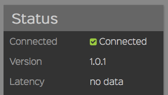
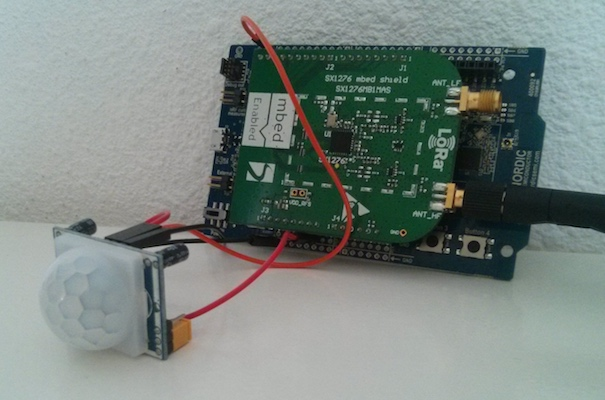
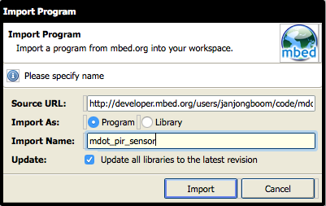
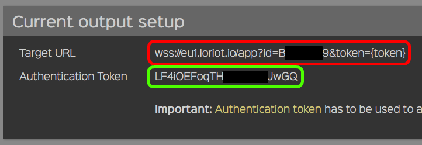
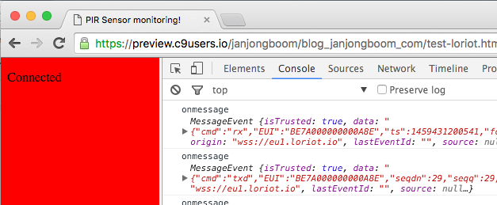

# Setting up your LoRa network on LORIOT

If you haven't done so, read [Building your own private LoRa network](intro-to-lora.md) first.

Now that we have set up the gateways and they can reach the internet, it's time to install the LORIOT software on them, so they have a place to send the LoRa packets.

## Installing the LORIOT software

1. [Sign up](https://eu1.loriot.io/register.html) for an account.
1. You're redirected to the dashboard page.
1. Click the link to register a new gateway.

    <span class="images"><span>First step to registering a new gateway</span></span>

1. You're now taken through a wizard. Just pick the gateway you have and follow the steps.
1. You're taken to the gateway page where you'll find the LORIOT binary for your platform, and a link to set up documentation.

    <span class="images"><span>Almost there...</span></span>

	<span class="tips">**Tip:** Use a tool like scp to copy the binary from your computer to the gateway. For example: </br>``scp ~/Downloads/loriot_pi_2_iC880A_USB_1.0.1.tar pi@192.168.2.7:~/``</span>

1. The gateway now shows as connected on the LORIOT gateway page and we're ready to work on the device.

    <span class="images"><span>Connected!</span></span>

<span class="tips">**Tip:** LORIOT has a 'Gateway Tap', which you can access from your gateway page. This allows you to see what messages are being picked up by the gateway - very useful when debugging.</span>

### Automatically starting the LORIOT binary when the gateway starts

#### Kerlink IoT station

If you followed the installation steps in the LORIOT documentation, the binary will automatically start whenever the gateway boots. No additional steps required.

#### Multitech Conduit

1. Log in over SSH or via the serial port.
1. Create a new file ``/etc/init.d/start-loriot.sh``.
1. Edit this file (via `nano /etc/init.d/start-loriot.sh`) and add the following content:

    ``cd /home/root/ && ./loriot_multitech_conduit_mCard_USB_1.0.1``

    * If you extracted the LORIOT binary somewhere else, edit the path.
    * We're CDing into the folder first, otherwise LORIOT cannot find its certificate.

1. Make the file executable: `chmod +x /etc/init.d/start-loriot.sh`.
1. Link the script: `ln -s /etc/init.d/start-loriot.sh /etc/rc5.d/S99start-loriot.sh`.
1. Now reboot the gateway and verify that the LORIOT binary is running (via `ps aux | grep loriot`).

#### Raspberry Pi and IMST iC880A

Follow the steps on [this page](http://raspberrypi.stackexchange.com/questions/8734/execute-script-on-start-up) to start the LORIOT binary when the Raspberry Pi starts up.

## Building a device

Now off to the interesting work: building a device that can send sensor data over the LoRa network. For example, you can create a simple motion sensor using a [PIR sensor](https://www.adafruit.com/products/189) (under 10 euros at your local hardware store, and 2 euros when ordering from China). Of course, you are free to hook up a different sensor.

<span class="images"><span>PIR sensor hooked up to a Nordic Semiconductor nRF51-DK with a LoRa shield</span></span>

### Some notes on writing firmware

1. You cannot send data constantly because of duty cycle limitations. This is a requirement of using the open spectrum. If you send too quickly, sending will fail.
1. A disadvantage of the LoRa shield is that it blocks all the pins. You can solder some new headers on the back of the shield to add new peripherals, or use a microcontroller like the nRF51-DK that has the pins available twice, once through hole connectors and once through female headers.

### Registering the device on LORIOT

LoRa is end-to-end encrypted, with two sets of keys. We'll need to program these keys, plus a device ID, into the device firmware. We use these keys to sign our messages and be verified by the network server.

To generate a new key pair:

1. Go to the LORIOT dashboard.
1. Click *Applications > Sample App > Manage Devices > Generate New Device*.
1. A device is added to the list.
1. Click the device to go to the device page.
1. At the bottom of the page, find *Seqno checking* and change this setting to *Relax* (call `setRelax()` from the JS console if the button does not show up).

<span class="images"><span>Relax, take it easy</span></span>

Now that we have the keys we can start writing some software.

### Using the LoRa shield


#### Importing the boilerplate program into the online IDE

1. [Sign up](https://developer.mbed.org/account/signup/?next=%2F) for an account on ARM mbed, which hosts the online compiler we'll be using.
1. Find your microcontroller on [the Platforms page](https://developer.mbed.org/platforms/).
1. Click *Add to your mbed compiler*.
1. Go to [LoRaWAN-lmic-app](https://developer.mbed.org/teams/Semtech/code/LoRaWAN-lmic-app/).
1. Click *Import this program*.
1. You're redirected to the online compiler, where you can give the program a name.


	<span class="images"><span>Importing a program to get started</span></span>

<span class="notes">**Note:** Make sure that you select the right board in the top right corner of the compiler.</span>

<span class="images"><span>Selecting the right board is kinda important</span></span>


#### Setting shield frequency

We need to set the right frequency for the version of the shield you have (and where you are in the world).

Open ``LMiC/lmic.h``, and find the following lines:

```cpp
// mbed compiler options
//#define CFG_eu868                                   1
#define CFG_us915                                   1
```

Make sure the right line is uncommented, depending on the shield version that you have.

__If you have the SX1276MB1LAS:__

```cpp
//#define CFG_eu868                                   1
#define CFG_us915                                   1
```

__If you have the SX1276MB1MAS:__

```cpp
#define CFG_eu868                                   1
//#define CFG_us915                                   1
```

#### Adding LORIOT keys

Now let's program the keys from LORIOT into the device firmware.

<span class="images"><span>Copying the address and the keys from LORIOT into the device firmware</span></span>

Open ``main.cpp``, and change the following lines:

```cpp
#define LORAWAN_DEV_ADDR                            ( uint32_t )0x12345678

static uint8_t NwkSKey[] =
{
    0x2B, 0x7E, 0x15, 0x16, 0x28, 0xAE, 0xD2, 0xA6,
    0xAB, 0xF7, 0x15, 0x88, 0x09, 0xCF, 0x4F, 0x3C
};

// application session key
static uint8_t ArtSKey[] =
{
    0x2B, 0x7E, 0x15, 0x16, 0x28, 0xAE, 0xD2, 0xA6,
    0xAB, 0xF7, 0x15, 0x88, 0x09, 0xCF, 0x4F, 0x3C
};
```

* Set `LORAWAN_DEV_ADDR` to the *big endian* DevAddr from LORIOT (green), prefixed with `0x`.
* Set `NwkSKey` and `ArtSKey` to the NWKSKEY (orange) and APPSKEY (yellow) from LORIOT, but turn them into hex numbers. For example, a LORIOT key of `5ADA30AA` should be `0x5A, 0xDA, 0x30, 0xAA` in your code.


#### Verifying our setup

Now we can verify whether our setup works, by clicking the *Compile* button.

<span class="images"><span>Compile button</span></span>

When compilation succeeds a file is downloaded.

Plug your development board into the computer (over micro-USB) to mount it as a USB mass storage device. In most cases no drivers should be needed, but they are [here](https://developer.mbed.org/handbook/Windows-serial-configuration) just in case.

Once the device mounts, drag the compiled file onto the board. This causes the device to boot up. You can then see messages coming in to the LORIOT device page:

<span class="images"><span>We've got data!</span></span>

#### Switching to manual sending

By default the application sends data automatically. If you want to change this, remove these lines from ``main.cpp``:

```cpp
if( txOn == true )
{
    //Sends frame every APP_TX_DUTYCYCLE +/- APP_TX_DUTYCYCLE_RND random time (if not duty cycle limited)
    os_setTimedCallback( &sendFrameJob,
                         os_getTime( ) + ms2osticks( APP_TX_DUTYCYCLE + randr( -APP_TX_DUTYCYCLE_RND, APP_TX_DUTYCYCLE_RND ) ),
                         onSendFrame );

    ////Sends frame as soon as possible (duty cycle limitations)
    //onSendFrame( NULL );
}
```

You can now add code that sends a message whenever you want it to, for example when an interrupt fires because someone moves in front of your PIR sensor. For example:

```cpp
InterruptIn pir(D5);

static void prepareTxFrame( void )
{
    LMIC.frame[0] = pir; // current state of the pir sensor
#if ( LORAWAN_CONFIRMED_MSG_ON == 1 )
    LMIC.frame[1] = LMIC.seqnoDn >> 8;
    LMIC.frame[2] = LMIC.seqnoDn;
    LMIC.frame[3] = LMIC.rssi >> 8;
    LMIC.frame[4] = LMIC.rssi;
    LMIC.frame[5] = LMIC.snr;
#endif
}

void movement() {
    onSendFrame(NULL);
}

void no_movement() {
    onSendFrame(NULL);
}

int main( void ) {

    pir.rise(movement);
    pir.fall(no_movement);

    // ... lora related things
}
```

Change the content of the `prepareTxFrame` function to change which data you're sending (also update `LORAWAN_APP_DATA_SIZE`). Now we'll get a message whenever the PIR sensor changes state (from motion to no-motion and the other way around).

### Using the Multitech mDot


#### Importing the boilerplate program into the online IDE

1. [Sign up](https://developer.mbed.org/account/signup/?next=%2F) for an account on ARM mbed, which hosts the online compiler we'll be using.
1. Go to the [Multitech mDot platform page](https://developer.mbed.org/platforms/MTS-mDot-F411/).
1. Click *Add to your mbed compiler*.
1. Go to the [mdot_personalized_activation](https://developer.mbed.org/users/janjongboom/code/mdot_personalized_activation/) project page.
1. Click *Import this program*.
1. You're redirected to the online compiler where you can give the program a name.

<span class="images"><span>Importing a program to get started</span></span>

<span class="notes">**Note:** Make sure that you select the right board in the top right corner of the compiler.</span>

<span class="images"><span>Selecting the right board is kinda important</span></span>

#### Adding LORIOT keys

Now let's program the keys from LORIOT into the device firmware.

<span class="images"><span>Copying the address and the keys from LORIOT into the device firmware</span></span>

Open ``main.cpp``, and copy the big endian `DevAddr` (green), the `NWKSKEY` (orange) and the `NWKSKEY` (yellow) from LORIOT into the application:

```cpp
static const char LORIOT_DEV_ADDR[]  = "AABBCCDD"; // green
static const char LORIOT_NWK_S_KEY[] = "E8A25EBD07F85800E08478A041FACBA7"; // orange
static const char LORIOT_APP_S_KEY[] = "BE8EF84E745D0AB14D4507B0BA600555"; // yellow
```

#### Verifying our setup

Now we can verify whether our setup works, by clicking the *Compile* button.

<span class="images"><span>Compile button</span></span>

When compilation succeeds a file is downloaded.

Plug your development board into the computer (over micro-USB) to mount it as a USB mass storage device. In most cases no drivers should be needed, but they are [here](https://developer.mbed.org/handbook/Windows-serial-configuration) just in case.

Once the device mounts, drag the compiled file onto the board. This causes the device to boot up. You can then see messages coming in to the LORIOT device page:

<span class="images"><span>We've got data!</span></span>

#### Switching to manual sending

By default the application sends data automatically. If you want to change this, you can remove the `send_data();` call, and call it manually (for example from an interrupt). See the section above about the LoRa shield for more information.

## Building a web application

Now that we have the first three parts of our network up and running, it's time to use the sensor data in a small application. LORIOT offers a number of ways of getting your data out of their service, but the easiest is using a websocket. We can write a quick web application that will turn the page red when movement is detected, and green when everything is OK. We do this by checking the first byte of the LoRa payload (1=movement, 0=no movement).

1. In LORIOT: go to your dashboard and click *Applications > Sample App > Output*.
1. Change the output type to *WebSocket*.

	<span class="images"><span>Websocket</span></span>

1. Copy the URL and the token under *Current output setup* and paste them in the code sample below:

	<span class="images"><span>Retrieving the API parameters from the output tab in LORIOT</span></span>

```html
<!DOCTYPE html>
<html>
<head>
    <title>PIR Sensor monitoring!</title>
</head>
<body>
    <p id="status">Connecting...</p>
    <script>
    var token = 'YOUR_AUTHENTICATION_TOKEN_HERE';
    var url = 'YOUR_TARGET_URL_HERE (incl {token} part)';
    var ws = new WebSocket(url.replace('{token}', token));
    ws.onopen = function() {
        document.querySelector('#status').textContent = 'Connected';
    };
    ws.onclose = function() {
        document.querySelector('#status').textContent = 'Disconnected';
    };
    ws.onmessage = function(e) {
        console.log('onmessage', e);
        var data = JSON.parse(e.data);
        if (data.cmd !== 'rx') return;

        switch (Number(data.data.slice(0, 2))) {
            case 0: document.body.style.backgroundColor = 'green'; break;
            case 1: document.body.style.backgroundColor = 'red'; break;
        }
    };
    </script>
</body>
</html>
```

And done! We now have a fully functioning LoRa network with a device, a gateway and a web application:

	<span class="images"><span>Full circle</span></span>

## Conclusion

LoRa is a great technology with a lot of potential, especially because anyone can set up a network and get started building long range IoT devices with a relatively small investment. I hope that this guide will help you get started, and would love to see what you build with LoRa and ARM mbed!
